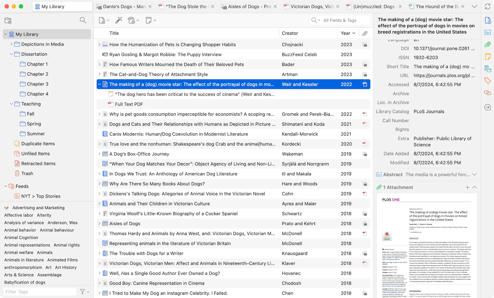

# Zotero   



**Zotero** es un software de código abierto diseñado para gestionar y organizar referencias bibliográficas y documentos. Es ampliamente utilizado por investigadores, estudiantes y académicos para recopilar, organizar, citar y compartir fuentes de investigación. Ofrece una solución accesible para manejar grandes cantidades de información de manera eficiente y está disponible en una versión que se puede ejecutar en contenedores Docker.

## rm_dkr_config
Este script automatiza la configuración y el despliegue de **Zotero** en contenedores Docker, simplificando la puesta en marcha y garantizando un entorno reproducible.

```shell
# rm_dkr_config_v-2.2

# 
# [Acceso --> http://localhost:3000]

DKR_NOM="zotero"     # ${DKR_NOM} Nombre del contenedor
DKR_POR="3000"       # ${DKR_POR} Puerto del contenedor

# Cadena con la configuración del archivo docker-compose
DKR_CFG=$(cat <<-EOF
---
services:
  zotero:
    image: lscr.io/linuxserver/zotero:latest
    container_name: ${DKR_NOM}
    security_opt:
      - seccomp:unconfined #optional
    environment:
      - PUID=1000
      - PGID=1000
      - TZ=America/Argentina/La_Rioja
    volumes:
      - /path/to/config:/config
    ports:
      - ${DKR_POR}:3000
      - 3001:3001
    shm_size: "1gb"
    restart: unless-stopped
---
EOF
)
```

## rm_dkr_install
Este script automatiza la creación del archivo `docker-compose` y la ejecución de Zotero en un contenedor Docker.

```shell
# rm_dkr_install_v-3.1

DKR_DIR="/docker/$DKR_NOM"
DKR_YML="$DKR_DIR/docker-compose.yml"

# Crear directorio y archivo docker-compose con la configuración
sudo mkdir -p "$DKR_DIR" && echo "$DKR_CFG" | sudo tee "$DKR_YML" > /dev/null

# Ejecutar docker-compose
sudo docker-compose -f "$DKR_YML" up -d

```

# rm_dkr_clean
Este script automatiza la tarea de detener, eliminar un contenedor Docker y remover la imagen asociada. Es útil para mantener limpio el entorno Docker y liberar espacio en el sistema.
```shell
# rm_dkr_clean_v-2.2

# Obtiene el ID del contenedor basado en el nombre o imagen
DKR_LID=$(sudo docker ps | grep $DKR_NOM | awk '{print $1}')

# Obtiene la imagen asociada al contenedor
DKR_IMG=$(sudo docker ps --filter "id=$DKR_LID" --format "{{.Image}}")

# Detiene, elimina el contenedor y elimina la imagen
sudo docker stop $DKR_LID
sudo docker rm $DKR_LID
sudo docker rmi $DKR_IMG

```
