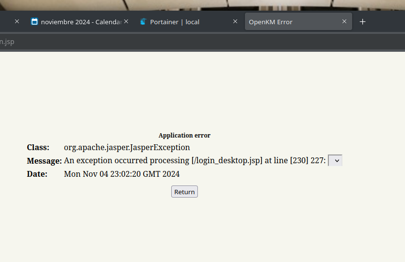

# OpenKM

## No se pudo hacer funcionar 
 Tire el siguiente error lugo de hacer toda la composición.



## inst_dkr_OpenKM.sh

```bash
DK_NOM="openkm"
DK_PRT="8080"

DK_DIR="/docker/$DK_NOM"
DK_CMP="$DK_DIR/docker-compose.yml"

sudo mkdir -p "$DK_DIR" && cat <<-EOF | sudo tee "$DK_CMP" > /dev/null

version: "2"
services:
  # Our base OpenKM service is at the localhost. If hosting these on a domain,
  # change the "localhost:8080" to your domain and optionally change the ports.
  # if you are using ingress as a proxy, then you can make the exposed port anything
  # but it must map to 8080 on the container.
  openkm:
    image: mbagnall/openkm:mysql
    container_name: openkm
    environment:
      OPEN_KM_URL: http://localhost:${DK_PRT}/OpenKM
      OPEN_KM_BASE_URL: http://localhost:${DK_PRT}
    ports:
      - ${DK_PRT}:8080
    volumes:
      - ./data:/opt/tomcat-8.5.69/repository
    depends_on:
      - db
    restart: unless-stopped

  # We need to start our MySQL service without grant tables and with an init
  # file to create the user. This allows the magic process of "start service,
  # start using". If you need a more MySQL environment, be sure to check out
  # the information in the readme about a more secure mysql.
  db:
    image: mysql:5.7
    container_name: openkm-datastore
    command: --skip-grant-tables --init-file=/opt/init-file/init-file.sql
    environment:
      MYSQL_ROOT_PASSWORD: OpenKM77
      MYSQL_ALLOW_EMPTY_PASSWORD: 0
    expose:
      - 3306
    volumes:
      - ./openkm-datastore:/var/lib/mysql
      - ./openkm-init-file:/opt/init-file
    restart: unless-stopped
    
EOF

sudo docker-compose -f "$DK_CMP" up -d

```

