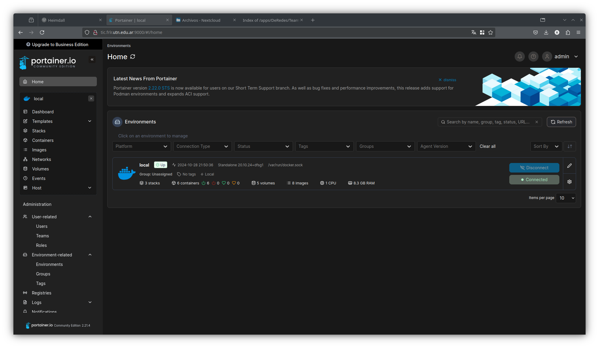

# Despliegue de Portainer con Docker

  [](mailto:admin@example.com)

## 📋 Índice

1. [Descripción](#descripción)
2. [Variables de Configuración](#variables-de-configuración)
3. [Procedimiento](#procedimiento)
4. [Referencias](#referencias)

## 📝 Descripción

Este documento proporciona instrucciones detalladas para la implementación de Portainer utilizando Docker. Portainer es una herramienta de administración de contenedores que permite una interfaz gráfica para gestionar y supervisar los servicios Docker.

## ⚙️ Variables de Configuración

Antes de ejecutar el despliegue, define las siguientes variables de configuración en tu terminal:

```bash
DKR_NOM="portainer"                         # Nombre del contenedor
DKR_IMG="portainer/portainer-ce:latest"     # Imagen de Portainer (última versión)
DKR_POR="9000"                              # Puerto para acceder a Portainer
```

## 🚀 Procedimiento

### 1. Detener y eliminar cualquier contenedor anterior

Para evitar conflictos, detén y elimina cualquier instancia anterior de Portainer que esté utilizando la misma imagen.

```bash
DKR_NOM="portainer"
DKR_IMG="portainer/portainer-ce:latest"
DKR_POR="9000"

DKR_LID=$(sudo docker ps | grep $DKR_IMG | awk '{print $1}')  # Obtener ID del contenedor en ejecución
sudo docker stop $DKR_LID                                     # Detener contenedor actual
sudo docker rm $DKR_LID                                       # Eliminar contenedor detenido
sudo docker rmi $DKR_IMG                                      # Eliminar la imagen de Docker
```

### 2. Desplegar Portainer

Ejecuta el siguiente comando para crear y desplegar una nueva instancia de Portainer.

```bash
DKR_NOM="portainer"
DKR_IMG="portainer/portainer-ce:latest"
DKR_POR="9000"

sudo docker run -d -p $DKR_POR:9000 -p 9443:9443 \
    --name=$DKR_NOM --restart=always \
    -v /var/run/docker.sock:/var/run/docker.sock \
    -v portainer_data:/data $DKR_IMG
```

#### Explicación de los parámetros:
- **`-d`**: Ejecuta el contenedor en modo desacoplado (background).
- **`-p $DKR_POR:9000 -p 9443:9443`**: Asocia los puertos 9000 y 9443 del host con los mismos puertos en el contenedor.
- **`--name=$DKR_NOM`**: Asigna el nombre `portainer` al contenedor.
- **`--restart=always`**: Configura el contenedor para que se reinicie automáticamente.
- **`-v /var/run/docker.sock:/var/run/docker.sock`**: Permite que Portainer gestione el demonio de Docker del host.
- **`-v portainer_data:/data`**: Define un volumen para almacenar los datos persistentes de Portainer.

### 3. Acceder a la Interfaz Web de Portainer

Una vez que el contenedor esté en ejecución, puedes acceder a la interfaz web de Portainer desde un navegador utilizando la dirección IP de tu máquina y el puerto configurado (por defecto, `9000`):

```plaintext
http://localhost:9000
```



## 🔗 Referencias

- [Documentación Oficial de Portainer](https://www.portainer.io/documentation)
- [Docker Hub: Imagen de Portainer](https://hub.docker.com/r/portainer/portainer-ce)
