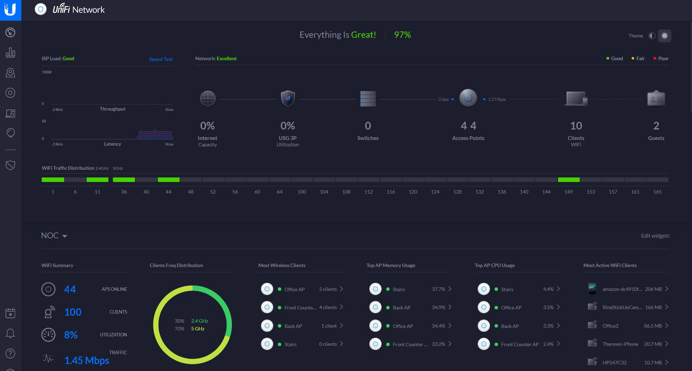

# UniFi



Un **UniFi Controller** es un software de gestión centralizada desarrollado por Ubiquiti Networks para administrar dispositivos de la serie UniFi, como puntos de acceso Wi-Fi, switches, routers y cámaras IP. Este servidor actúa como el "cerebro" del ecosistema UniFi, permitiendo a los administradores configurar, monitorizar y gestionar todos los dispositivos conectados desde una única interfaz centralizada.

## rm_dkr_config
Este script automatiza la configuración y el despliegue del contenedor Docker, simplificando la puesta en marcha y garantizando un entorno reproducible.

  
  [Acceso --> http://localhost:3000]

```shell
# rm_dkr_config_v-3.1

DKR_NOM="unifi"
DKR_POR="8080"
DKR_TMZ="America/Argentina/La_Rioja"
# ${DKR_NOM} ${DKR_POR} ${DKR_TMZ}

DKR_CFG=$(cat <<-EOF
---
version: '3'

services:
  unifi:
    image: ghcr.io/goofball222/unifi
    container_name: ${DKR_NOM}
    restart: unless-stopped
    network_mode: bridge
    ports:
      - 3478:3478/udp
      - ${DKR_POR}:8080
      - 8443:8443
      - 8880:8880
      - 8843:8843
    volumes:
      - /etc/localtime:/etc/localtime:ro
      - ./cert:/usr/lib/unifi/cert
      - ./data:/usr/lib/unifi/data
      - ./logs:/usr/lib/unifi/logs
    environment:
      - TZ=${DKR_TMZ}
---
EOF
)
```

## rm_dkr_install
Este script automatiza la creación del archivo `docker-compose` y la ejecución del contenedor Docker.

```shell
# rm_dkr_install_v-3.1

DKR_DIR="/docker/$DKR_NOM"
DKR_YML="$DKR_DIR/docker-compose.yml"

sudo mkdir -p "$DKR_DIR" && echo "$DKR_CFG" | sudo tee "$DKR_YML" > /dev/null

sudo docker-compose -f "$DKR_YML" up -d

```

# rm_dkr_clean
Este script automatiza la tarea de detener, eliminar un contenedor Docker y remover la imagen asociada. Es útil para mantener limpio el entorno Docker y liberar espacio en el sistema.
```shell
# rm_dkr_clean_v-3.1

# Verificar $DKR_NOM está Cargado.

DKR_LID=$(sudo docker ps | grep $DKR_NOM | awk '{print $1}')

DKR_IMG=$(sudo docker ps --filter "id=$DKR_LID" --format "{{.Image}}")

sudo docker stop $DKR_LID
sudo docker rm $DKR_LID
sudo docker rmi $DKR_IMG

```
